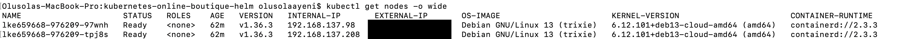
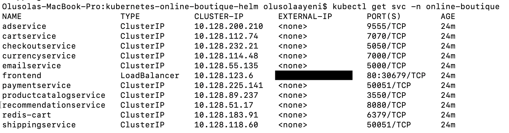
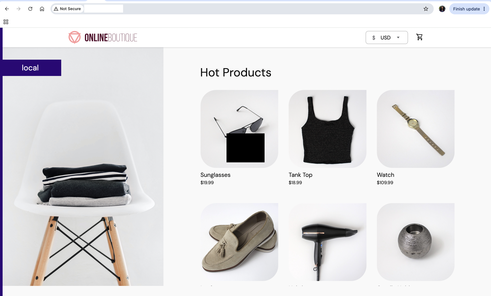
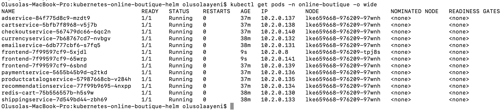

# Kubernetes Online Boutique Deployment with Helm, Helmfile, Minikube and LKE

A hands-on Kubernetes and DevOps project demonstrating how a multi-microservice application can be converted from standard Kubernetes manifests into reusable Helm charts, orchestrated with Helmfile, validated locally with Minikube, and deployed to a real managed Kubernetes environment using **Linode Kubernetes Engine (LKE)**.

This project uses Google's **Online Boutique** sample application as the underlying microservices workload. The engineering work in this repository focuses on Kubernetes deployment, Helm templating, Helmfile orchestration, environment-specific configuration, cloud deployment, service exposure, workload scaling, validation, and infrastructure lifecycle management.

---

## Author

**Olusola Ayeni**

---

## Project Overview

Online Boutique is a cloud-native e-commerce application composed of multiple microservices.

This project was used to build practical experience with:

- Kubernetes
- Helm
- Helmfile
- Minikube
- Linode Kubernetes Engine (LKE)
- Kubernetes contexts
- Kubernetes namespaces
- Kubernetes Services
- LoadBalancers
- Kubernetes scheduling
- Horizontal scaling
- Environment-specific configuration
- Cloud infrastructure lifecycle management
- Git and GitHub documentation

The project progressed through the following stages:

```text
Kubernetes Manifests
        |
        v
Reusable Helm Charts
        |
        v
Helmfile Orchestration
        |
        v
Minikube Deployment
        |
        v
LKE-Specific Configuration
        |
        v
Linode Kubernetes Engine
        |
        v
Public LoadBalancer
        |
        v
Browser Verification
        |
        v
Horizontal Scaling
        |
        v
Multi-Node Scheduling
        |
        v
Cloud Resource Cleanup
```

---

## Project Objectives

The main objectives of this project were to:

- Deploy a multi-service application to Kubernetes.
- Understand Kubernetes Deployments and Services.
- Convert repeated Kubernetes manifests into reusable Helm templates.
- Manage multiple microservices using Helmfile.
- Separate local Minikube configuration from cloud LKE configuration.
- Validate the deployment locally before using cloud infrastructure.
- Deploy the application to Linode Kubernetes Engine.
- Isolate the cloud deployment using a dedicated Kubernetes namespace.
- Expose the frontend publicly through an LKE LoadBalancer.
- Verify the application from a web browser.
- Scale workloads and observe Kubernetes scheduling behaviour.
- Practise safe destruction of cloud resources after testing.

---

## Technologies Used

| Technology | Purpose |
|---|---|
| Kubernetes | Container orchestration |
| Helm | Kubernetes package management and templating |
| Helmfile | Declarative orchestration of multiple Helm releases |
| Minikube | Local Kubernetes testing |
| Linode Kubernetes Engine | Managed cloud Kubernetes cluster |
| Akamai Cloud | Cloud infrastructure platform |
| kubectl | Kubernetes command-line administration |
| YAML | Kubernetes and Helm configuration |
| Git | Version control |
| GitHub | Source-code hosting and project documentation |

---

# Application Architecture

The Online Boutique application contains the following components:

- Ad Service
- Cart Service
- Checkout Service
- Currency Service
- Email Service
- Frontend
- Payment Service
- Product Catalog Service
- Recommendation Service
- Shipping Service
- Redis Cart

The simplified application architecture is:

```text
                        Internet
                           |
                           v
                  LKE LoadBalancer
                           |
                           v
                    Frontend Service
                           |
                           v
                     Frontend Pods
                           |
          +----------------+----------------+
          |                |                |
          v                v                v
     Cart Service     Product Catalog   Checkout Service
          |                Service            |
          v                                   |
      Redis Cart                              |
                                              |
                         +--------------------+-------------------+
                         |                    |                   |
                         v                    v                   v
                  Payment Service      Shipping Service     Email Service

                         +----------------------------------------+
                         |
                         +--> Currency Service
                         +--> Recommendation Service
                         +--> Ad Service
```

Backend services are exposed internally using Kubernetes `ClusterIP` Services.

The frontend is exposed externally using a Kubernetes `LoadBalancer` Service.

---

# Repository Structure

```text
kubernetes-online-boutique-helm/
│
├── charts/
│   │
│   ├── microservice/
│   │   ├── templates/
│   │   │   ├── deployment.yaml
│   │   │   └── service.yaml
│   │   ├── .helmignore
│   │   ├── Chart.yaml
│   │   └── values.yaml
│   │
│   └── redis/
│
├── manifests/
│
├── screenshots/
│
├── values/
│   └── lke/
│       ├── adservice.yaml
│       ├── cartservice.yaml
│       ├── checkoutservice.yaml
│       ├── currencyservice.yaml
│       ├── emailservice.yaml
│       ├── frontend.yaml
│       ├── paymentservice.yaml
│       ├── productcatalogservice.yaml
│       ├── recommendationservice.yaml
│       └── shippingservice.yaml
│
├── helmfile.yaml
├── helmfile-lke.yaml
└── README.md
```

---

# 1. Initial Kubernetes Deployment

The first stage of the project used standard Kubernetes manifests.

These manifests defined resources such as:

- Deployments
- Services
- Replica counts
- Container images
- Environment variables
- Container ports

This stage helped establish how the different Online Boutique microservices interact inside Kubernetes.

The application was initially tested using Minikube.

---

# 2. Converting Kubernetes Manifests to Helm

Maintaining separate Kubernetes manifests for every microservice creates significant duplication.

A reusable Helm chart was therefore created under:

```text
charts/microservice/
```

The chart contains generic templates for resources such as:

```text
Deployment
Service
```

Values supplied to the chart determine the configuration of each microservice.

Examples include:

```yaml
appName:
appImage:
appVersion:
appReplicas:
containerPort:
containerEnvVars:
resources:
```

This allows the same Helm chart to be reused for multiple services, including:

```text
adservice
cartservice
checkoutservice
currencyservice
emailservice
frontend
paymentservice
productcatalogservice
recommendationservice
shippingservice
```

Redis uses a separate Helm chart because its configuration differs from the generic application microservices.

---

# 3. Helmfile Orchestration

Installing every microservice individually with Helm would require managing many separate commands.

Helmfile was introduced to manage the complete application declaratively.

Instead of running multiple `helm install` commands, all application releases can be synchronised using:

```bash
helmfile sync
```

The Helm releases include:

```text
adservice
cartservice
checkoutservice
currencyservice
emailservice
frontendservice
paymentservice
productcatalogservice
recommendationservice
rediscart
shippingservice
```

An important naming distinction in this project is:

```text
Helm release:           frontendservice
Kubernetes Deployment: frontend
Kubernetes Service:    frontend
```

Therefore:

```bash
helm list
```

shows:

```text
frontendservice
```

while:

```bash
kubectl get deployment
```

and:

```bash
kubectl get svc
```

show:

```text
frontend
```

---

# 4. Local Deployment with Minikube

Before deploying to the cloud, the Helm and Helmfile configuration was validated locally using Minikube.

The active Kubernetes context was checked using:

```bash
kubectl config current-context
```

For the local environment, the result was:

```text
minikube
```

Application resources were verified using:

```bash
kubectl get pods
```

Helm releases were checked using:

```bash
helm list -A
```

This provided a safe environment to validate the Helm charts before introducing cloud infrastructure.

---

# 5. Understanding Kubernetes Contexts

One of the important lessons from the project was that the Kubernetes context determines which cluster receives commands.

For example:

```bash
kubectl config current-context
```

may return:

```text
minikube
```

when using the local cluster.

After configuring LKE, the active context changes to the LKE cluster context.

The filename:

```text
helmfile-lke.yaml
```

does **not** automatically cause Helmfile to deploy to LKE.

Helm and Helmfile communicate with whichever Kubernetes cluster is defined by the active kubeconfig/context.

This makes checking the context before deployment an important operational habit:

```bash
kubectl config current-context
kubectl get nodes
```

---

# 6. Understanding Kubernetes Namespaces

A dedicated namespace was used for the LKE deployment:

```text
online-boutique
```

It was created using:

```bash
kubectl create namespace online-boutique
```

Creating a namespace does not automatically switch the current namespace.

For example:

```bash
kubectl create namespace online-boutique
```

only creates the namespace.

Resources can be explicitly queried using:

```bash
kubectl get pods -n online-boutique
```

Helmfile can also be explicitly instructed to target the namespace:

```bash
helmfile -f helmfile-lke.yaml \
  --namespace online-boutique \
  sync
```

---

# 7. LKE-Specific Configuration

A separate Helmfile was created for the cloud deployment:

```text
helmfile-lke.yaml
```

LKE-specific values are stored under:

```text
values/lke/
```

This separates cloud-specific configuration from local Minikube configuration.

The directory contains configuration for the individual microservices, including:

```text
values/lke/adservice.yaml
values/lke/cartservice.yaml
values/lke/checkoutservice.yaml
values/lke/currencyservice.yaml
values/lke/emailservice.yaml
values/lke/frontend.yaml
values/lke/paymentservice.yaml
values/lke/productcatalogservice.yaml
values/lke/recommendationservice.yaml
values/lke/shippingservice.yaml
```

The frontend configuration uses a Kubernetes `LoadBalancer` Service so that the application can be reached from outside the Kubernetes cluster.

---

# 8. Creating the LKE Cluster

A Kubernetes cluster was created using Linode Kubernetes Engine.

The environment contained multiple worker nodes.

After downloading the LKE kubeconfig, the local shell was configured to communicate with the LKE cluster.

The active Kubernetes context was verified using:

```bash
kubectl config current-context
```

The LKE worker nodes were then verified using:

```bash
kubectl get nodes -o wide
```

Both worker nodes reached:

```text
STATUS: Ready
```

This confirmed that the Kubernetes cluster was operational and that the worker nodes were available for scheduling workloads.

### LKE Worker Nodes

The worker-node status was captured as deployment evidence:



---

# 9. Creating the LKE Namespace

The application namespace was created only after confirming that `kubectl` was targeting the LKE cluster.

```bash
kubectl create namespace online-boutique
```

The namespace was then confirmed using:

```bash
kubectl get namespaces
```

This avoided accidentally creating the namespace or deploying the cloud workload back into Minikube.

---

# 10. Deploying Online Boutique to LKE

Before deployment, the target environment was verified again:

```bash
kubectl config current-context
```

and:

```bash
kubectl get nodes
```

The Online Boutique application was then deployed using:

```bash
helmfile -f helmfile-lke.yaml \
  --namespace online-boutique \
  sync
```

Helmfile built the required chart dependencies and deployed all application releases to the LKE cluster.

---

# 11. Verifying Helm Releases

The Helm releases were verified using:

```bash
helm list -n online-boutique
```

The following releases were successfully deployed:

```text
adservice
cartservice
checkoutservice
currencyservice
emailservice
frontendservice
paymentservice
productcatalogservice
recommendationservice
rediscart
shippingservice
```

All releases reported:

```text
STATUS: deployed
```

---

# 12. Verifying Kubernetes Deployments

The Kubernetes Deployments were checked using:

```bash
kubectl get deployments -n online-boutique
```

The initial deployment showed:

```text
READY        1/1
UP-TO-DATE   1
AVAILABLE    1
```

for all application deployments.

This confirmed that Kubernetes had successfully created the required workloads.

---

# 13. Verifying Kubernetes Pods

The pods were inspected using:

```bash
kubectl get pods -n online-boutique -o wide
```

The application pods reached:

```text
READY      1/1
STATUS     Running
RESTARTS   0
```

The `NODE` column was also used to identify which LKE worker node was running each pod.

This confirmed successful scheduling of application containers onto LKE worker infrastructure.

---

# 14. Kubernetes Services

The application Services were checked using:

```bash
kubectl get svc -n online-boutique
```

Backend services were exposed using:

```text
ClusterIP
```

including:

```text
adservice
cartservice
checkoutservice
currencyservice
emailservice
paymentservice
productcatalogservice
recommendationservice
redis-cart
shippingservice
```

These services are intended for communication inside the Kubernetes cluster.

The frontend Service is named:

```text
frontend
```

and was exposed using:

```text
LoadBalancer
```

It can be checked directly using:

```bash
kubectl get svc frontend -n online-boutique
```

### LKE Frontend LoadBalancer

The frontend Service successfully received an external LoadBalancer address from LKE:



---

# 15. Public Application Access

The frontend was checked using:

```bash
kubectl get svc frontend -n online-boutique
```

The Service showed:

```text
TYPE: LoadBalancer
PORT: 80
```

The application was then accessed using:

```text
http://<EXTERNAL-IP>
```

The Online Boutique homepage loaded successfully in a browser.

This confirmed the complete request path:

```text
Internet
   |
   v
LKE LoadBalancer
   |
   v
Frontend Kubernetes Service
   |
   v
Frontend Pod
   |
   v
Backend Microservices
```

---

# 16. Browser Verification

Successful browser access provided the final end-to-end test of the deployment.

The browser confirmed that:

- The Online Boutique frontend loaded correctly.
- Product images were displayed.
- Product information was returned.
- The application was externally reachable.
- The frontend could communicate successfully with backend services.
- Traffic successfully reached the application through the LKE LoadBalancer.

Healthy Kubernetes pods alone do not prove that an application is usable by an end user.

The browser test therefore provided important end-to-end validation.

### Online Boutique Running on LKE



---

# 17. Scaling the Frontend

The frontend was temporarily scaled from one replica to three replicas:

```bash
kubectl scale deployment frontend \
  --replicas=3 \
  -n online-boutique
```

The result was checked using:

```bash
kubectl get pods -n online-boutique -o wide
```

Three frontend pods were successfully created.

The output showed frontend replicas running across both LKE worker nodes.

For example:

```text
Frontend Replica 1
      |
      +------ Worker Node 1

Frontend Replica 2
      |
      +------ Worker Node 1

Frontend Replica 3
      |
      +------ Worker Node 2
```

This demonstrated that Kubernetes could schedule replicas across multiple nodes within the cluster.

The manual scaling operation changed the live Kubernetes Deployment only.

It did not modify the replica value stored in the Helm source configuration.

A later Helm reconciliation could therefore return the deployment to the replica count declared in Helm values.

### Frontend Replicas Across LKE Worker Nodes



---

# 18. Final Deployment Validation

The following commands were used to verify the completed deployment:

```bash
kubectl config current-context
```

```bash
kubectl get nodes -o wide
```

```bash
kubectl get namespace online-boutique
```

```bash
kubectl get pods -n online-boutique -o wide
```

```bash
kubectl get deployments -n online-boutique
```

```bash
kubectl get svc -n online-boutique
```

```bash
helm list -n online-boutique
```

Together these commands verified:

```text
LKE Kubernetes context          ✓
Worker nodes Ready              ✓
Dedicated namespace             ✓
Helm releases deployed          ✓
Deployments available           ✓
Pods Running                    ✓
Zero initial pod restarts       ✓
ClusterIP backend services      ✓
Frontend LoadBalancer           ✓
External browser access         ✓
Frontend horizontal scaling     ✓
Multi-node scheduling           ✓
```

---

# 19. Project Screenshots

Screenshots documenting the different stages of the project are stored in:

```text
screenshots/
```

A chronological naming convention is used.

Example screenshot structure:

```text
01-project-structure.png
02-helmfile-sync.png
03-helm-list.png
04-kubernetes-pods.png
05-kubernetes-services.png
06-helmfile-destroy.png
07-lke-current-context.png
08-lke-worker-nodes-ready.png
09-lke-pods-running.png
10-lke-deployments-ready.png
11-lke-services-loadbalancer.png
12-lke-helm-releases.png
13-online-boutique-browser-access.png
14-frontend-three-replicas-multi-node.png
```

The earlier screenshots document the Helm and Minikube phase.

The later screenshots document the LKE cloud deployment and final application validation.

Public infrastructure IP addresses may be redacted where they are not necessary to demonstrate the project.

Sensitive data such as the following must never be committed:

- API tokens
- Passwords
- Private keys
- Kubeconfig credentials
- Cloud access credentials
- Kubernetes Secrets containing real credentials

---

# 20. Cleaning Up the LKE Environment

Cloud infrastructure should not be left running unnecessarily after completing the demonstration.

The Helm releases can first be removed using:

```bash
helmfile -f helmfile-lke.yaml \
  --namespace online-boutique \
  destroy
```

The namespace can then be checked:

```bash
kubectl get all -n online-boutique
```

After confirming that the application resources have been removed:

```bash
kubectl delete namespace online-boutique
```

The LKE cluster can then be deleted from the Akamai/Linode Cloud Manager.

After deleting the Kubernetes cluster, the cloud account should also be checked for remaining infrastructure such as:

```text
NodeBalancers
Block Storage volumes
Compute resources
Reserved IP addresses
Project-specific firewall resources
```

This helps prevent unnecessary cloud charges.

---

# Key Learning Outcomes

This project provided practical experience beyond simply running Kubernetes commands.

## Kubernetes Context Management

I learned that the active Kubernetes context determines which cluster receives commands.

Checking:

```bash
kubectl config current-context
```

before deployment is important when working with multiple environments such as Minikube and LKE.

---

## Kubernetes Namespace Management

I learned that:

```bash
kubectl create namespace online-boutique
```

creates a namespace but does not automatically make it the current namespace.

Explicit namespace targeting helps reduce deployment mistakes.

For example:

```bash
kubectl get pods -n online-boutique
```

---

## Reusable Helm Charts

Instead of maintaining nearly identical Kubernetes YAML for every microservice, a reusable Helm chart allows common infrastructure patterns to be defined once and parameterised through values.

This improves:

- Maintainability
- Consistency
- Reusability
- Scalability of configuration

---

## Helm vs Helmfile

Helm manages application releases.

Helmfile coordinates multiple Helm releases as a larger application deployment.

For a microservices architecture, Helmfile makes it possible to manage the complete application stack declaratively.

---

## Environment Separation

Separating Minikube and LKE configuration reduces coupling between local development and cloud environments.

Environment-specific values can change without duplicating the underlying Helm charts.

---

## Kubernetes Services

I gained practical understanding of the difference between:

```text
ClusterIP
```

and:

```text
LoadBalancer
```

`ClusterIP` is suitable for internal microservice communication.

`LoadBalancer` allows an application to receive external traffic.

---

## Kubernetes Scheduling

Applications are deployed to a Kubernetes cluster rather than manually deployed to specific worker nodes.

The Kubernetes scheduler determines where pods should run.

By scaling the frontend to three replicas and examining:

```bash
kubectl get pods -n online-boutique -o wide
```

I was able to observe frontend replicas running across both LKE worker nodes.

---

## Desired State vs Live State

Running:

```bash
kubectl scale deployment frontend --replicas=3
```

changes the live Kubernetes Deployment.

It does not automatically update the desired state stored in Helm values.

This demonstrated the importance of keeping Infrastructure-as-Code and live-cluster configuration aligned.

---

## End-to-End Validation

A Kubernetes deployment should not be considered successful simply because pods are running.

The application should also be validated from the end-user perspective.

In this project, successful browser access through the LKE LoadBalancer provided that final validation.

---

## Cloud Cost Awareness

Cloud Kubernetes environments generate infrastructure costs.

Provisioning resources is only part of the lifecycle.

A complete workflow also includes:

```text
Provision
Deploy
Validate
Document
Destroy
Verify Cleanup
```

This project reinforced the importance of destroying temporary infrastructure when it is no longer required.

---

# Future Improvements

The current implementation successfully demonstrates the Kubernetes deployment lifecycle, but several improvements could move the environment closer to production-grade architecture.

---

## 1. HTTPS and TLS

The current demonstration exposes the frontend over HTTP.

A production-oriented version could:

- Configure a domain name.
- Issue TLS certificates.
- Redirect HTTP traffic to HTTPS.
- Automate certificate renewal.

Tools such as `cert-manager` and Let's Encrypt could be introduced.

---

## 2. Kubernetes Ingress

Instead of exposing the frontend directly using a `LoadBalancer` Service, an Ingress Controller could be introduced.

A future architecture could look like:

```text
Internet
   |
   v
LKE NodeBalancer
   |
   v
Ingress Controller
   |
   v
Ingress Resource
   |
   v
Frontend Service
   |
   v
Frontend Pods
```

This would provide more flexible HTTP routing and make it easier to expose additional applications.

---

## 3. Resource Requests and Limits

CPU and memory requests and limits could be defined for each service.

Example:

```yaml
resources:
  requests:
    cpu: 100m
    memory: 128Mi
  limits:
    cpu: 500m
    memory: 256Mi
```

This would allow Kubernetes to make better scheduling decisions and reduce the risk of one workload consuming excessive node resources.

---

## 4. Readiness and Liveness Probes

Application health checks could be added using:

- Readiness probes
- Liveness probes
- Startup probes

These would allow Kubernetes to detect unhealthy application instances and prevent traffic from reaching containers that are not ready.

---

## 5. Horizontal Pod Autoscaling

The frontend was manually scaled during this project.

A future implementation could use a Horizontal Pod Autoscaler so that Kubernetes automatically adjusts replica counts based on demand.

Example:

```text
Low Traffic
    |
    v
2 Frontend Pods

Traffic Increases
    |
    v
Horizontal Pod Autoscaler
    |
    v
Additional Frontend Pods
```

---

## 6. Topology Spread and Pod Anti-Affinity

Although frontend replicas were observed across both LKE worker nodes, Kubernetes was not explicitly instructed to distribute them.

A production implementation could use:

- Pod anti-affinity
- Node affinity
- Topology spread constraints

This would improve resilience by reducing the chance of all replicas being placed on the same worker node.

---

## 7. CI/CD Pipeline

Deployment could be automated using a CI/CD platform such as:

- GitHub Actions
- Jenkins

A future pipeline could perform:

```text
Git Push
   |
   v
YAML Validation
   |
   v
Helm Lint
   |
   v
Helm Template
   |
   v
Helmfile Diff
   |
   v
Automated Tests
   |
   v
Deploy to Kubernetes
```

This would reduce manual deployment steps and introduce repeatable validation.

---

## 8. Monitoring and Observability

Monitoring could be introduced using:

- Prometheus
- Grafana
- Kubernetes Metrics Server
- Centralised logging
- Alerting

This would provide visibility into:

```text
CPU utilisation
Memory utilisation
Pod health
Application latency
Application failures
Node health
Replica behaviour
```

---

## 9. Secrets Management

Sensitive configuration should not be stored directly in plain-text Helm values.

Future versions could use:

- Kubernetes Secrets
- Sealed Secrets
- External Secrets Operator
- Cloud-based secret-management services

---

## 10. Multiple Environments

The repository could be expanded to support:

```text
development
staging
production
```

while continuing to reuse the same Helm charts.

For example:

```text
values/
├── minikube/
├── staging/
└── production/
```

---

## 11. Infrastructure as Code

The LKE infrastructure was created through the cloud management interface.

A future implementation could use Terraform to provision:

```text
LKE Cluster
Worker Node Pools
Networking
DNS
Supporting Cloud Resources
```

This would make the infrastructure reproducible, auditable, and version controlled.

---

## 12. Automated Post-Deployment Testing

Automated tests could be added after deployment to verify:

- Frontend availability
- HTTP response codes
- Pod readiness
- Backend service connectivity
- Helm release status

The pipeline could fail automatically if the deployed application does not pass these checks.

---

# Project Result

The Online Boutique microservices application was successfully deployed through the complete Kubernetes lifecycle:

```text
Standard Kubernetes Manifests
             |
             v
Reusable Helm Charts
             |
             v
Helmfile Orchestration
             |
             v
Minikube Validation
             |
             v
LKE-Specific Configuration
             |
             v
Linode Kubernetes Engine
             |
             v
Dedicated Kubernetes Namespace
             |
             v
Healthy Microservices
             |
             v
Public LoadBalancer
             |
             v
Successful Browser Access
             |
             v
Horizontal Frontend Scaling
             |
             v
Multi-Node Scheduling
             |
             v
Deployment Documentation
             |
             v
Cloud Infrastructure Cleanup
```

The completed project demonstrates practical experience with:

- Kubernetes workload management
- Helm templating
- Helmfile orchestration
- Kubernetes contexts and namespaces
- Local and cloud environment separation
- Managed Kubernetes
- Kubernetes Services
- Cloud LoadBalancers
- Workload scaling
- Kubernetes scheduling
- Deployment validation
- Cloud-resource lifecycle management

---

# Upstream Application Attribution

This repository uses **Google's Online Boutique** sample application as the underlying microservices workload.

Online Boutique is an open-source cloud-native microservices demonstration application maintained by Google.

The original application is available from the upstream repository:

[GoogleCloudPlatform/microservices-demo](https://github.com/GoogleCloudPlatform/microservices-demo)

The focus of this project is not the development of the Online Boutique application itself.

The engineering work demonstrated in this repository focuses on:

- Kubernetes deployment
- Helm chart implementation
- Helmfile orchestration
- Minikube validation
- LKE-specific configuration
- Cloud Kubernetes deployment
- Workload scaling
- Service exposure
- Deployment validation
- Infrastructure cleanup

Refer to the upstream Online Boutique repository for the original application source code and licensing information.

---

# Conclusion

This project moved beyond deploying a single Kubernetes manifest and demonstrated a more complete DevOps workflow.

It covered the progression from raw Kubernetes manifests through Helm abstraction, Helmfile orchestration, local Kubernetes validation, cloud deployment with LKE, public application exposure, scaling across worker nodes, end-to-end validation, evidence collection, and responsible cloud-resource cleanup.

The result is a reusable Kubernetes deployment structure that can be extended further with:

- CI/CD
- Terraform
- Ingress
- HTTPS/TLS
- Horizontal Pod Autoscaling
- Monitoring and observability
- Secrets management
- Production-grade workload resilience